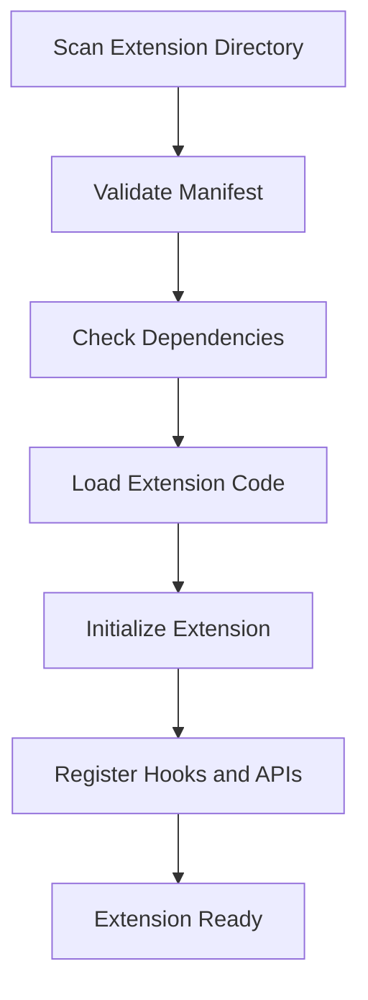
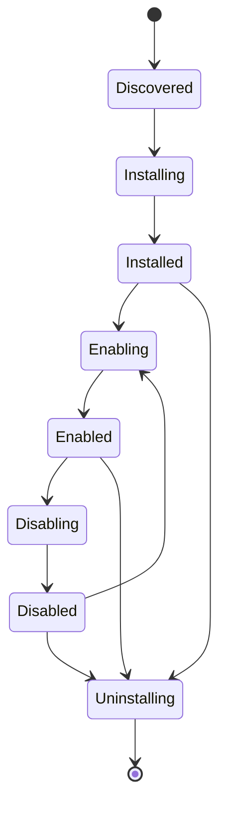

# Arcadia App Extension System Architecture Design

## Overview

This document outlines the comprehensive design for an extension system in Arcadia App, inspired by Playnite's plugin architecture. The system will allow third-party developers to extend the application's functionality through modular extensions that can integrate with the UI, database, and native features.

## Extension Types

Based on the requirements, the system will support three primary extension types:

### 1. UI Themes

- **Purpose**: Customize the application's visual appearance
- **Capabilities**:
  - Inject custom CSS stylesheets
  - Override component themes and colors
  - Add custom UI components
  - Modify layout structures
- **Integration Points**: React component tree, CSS injection, theme providers

### 2. Data Sources

- **Purpose**: Provide data from external sources
- **Capabilities**:
  - Fetch data from APIs, databases, or files
  - Transform and normalize data
  - Cache data locally
  - Provide real-time data updates
- **Integration Points**: Database layer, network requests, data processing pipelines

### 3. Game Libraries

- **Purpose**: Integrate with gaming platforms and services
- **Capabilities**:
  - Scan and import game metadata
  - Launch games through platform APIs
  - Sync game libraries
  - Provide platform-specific features
- **Integration Points**: Native system calls, file system access, process management

## Data Models

### Extension Metadata

```sql
CREATE TABLE extensions (
    id INTEGER PRIMARY KEY,
    name TEXT NOT NULL,
    version TEXT NOT NULL,
    author TEXT,
    description TEXT,
    type TEXT NOT NULL, -- 'theme', 'data_source', 'game_library'
    entry_point TEXT NOT NULL, -- Path to main script
    manifest_path TEXT NOT NULL,
    enabled BOOLEAN DEFAULT 1,
    installed_at DATETIME DEFAULT CURRENT_TIMESTAMP,
    updated_at DATETIME DEFAULT CURRENT_TIMESTAMP
);

CREATE TABLE extension_permissions (
    id INTEGER PRIMARY KEY,
    extension_id INTEGER,
    permission TEXT NOT NULL, -- 'filesystem', 'network', 'database', 'ui', 'native'
    granted BOOLEAN DEFAULT 0,
    FOREIGN KEY (extension_id) REFERENCES extensions(id)
);

CREATE TABLE extension_settings (
    id INTEGER PRIMARY KEY,
    extension_id INTEGER,
    key TEXT NOT NULL,
    value TEXT,
    FOREIGN KEY (extension_id) REFERENCES extensions(id)
);
```

### Extension Manifest Structure

```json
{
  "name": "My Extension",
  "version": "1.0.0",
  "author": "Developer Name",
  "description": "Extension description",
  "type": "theme|data_source|game_library",
  "entryPoint": "main.js",
  "permissions": ["ui", "database"],
  "dependencies": {
    "react": "^18.0.0"
  },
  "hooks": ["onAppStart", "onDataLoad"],
  "apis": {
    "provided": ["getGames"],
    "required": ["getSettings"]
  }
}
```

## Backend Extension Interfaces and APIs (Rust)

### Extension Manager

```rust
pub struct ExtensionManager {
    extensions: HashMap<String, Extension>,
    registry: ExtensionRegistry,
}

impl ExtensionManager {
    pub async fn load_extension(&mut self, path: &Path) -> Result<(), ExtensionError>;
    pub async fn unload_extension(&mut self, id: &str) -> Result<(), ExtensionError>;
    pub async fn call_hook(&self, hook: &str, params: Value) -> Result<Value, ExtensionError>;
    pub fn get_extension(&self, id: &str) -> Option<&Extension>;
}
```

### Extension Trait

```rust
#[async_trait]
pub trait Extension: Send + Sync {
    async fn initialize(&mut self, context: &ExtensionContext) -> Result<(), ExtensionError>;
    async fn shutdown(&mut self) -> Result<(), ExtensionError>;
    async fn handle_hook(&self, hook: &str, params: Value) -> Result<Value, ExtensionError>;
    fn get_manifest(&self) -> &ExtensionManifest;
    fn get_type(&self) -> ExtensionType;
}
```

### Tauri Commands for Extensions

```rust
#[tauri::command]
async fn install_extension(app: AppHandle, manifest_path: String) -> Result<String, String>;

#[tauri::command]
async fn uninstall_extension(app: AppHandle, extension_id: String) -> Result<(), String>;

#[tauri::command]
async fn enable_extension(app: AppHandle, extension_id: String) -> Result<(), String>;

#[tauri::command]
async fn disable_extension(app: AppHandle, extension_id: String) -> Result<(), String>;

#[tauri::command]
async fn list_extensions(app: AppHandle) -> Result<Vec<ExtensionInfo>, String>;

#[tauri::command]
async fn call_extension_api(app: AppHandle, extension_id: String, api: String, params: Value) -> Result<Value, String>;
```

## Frontend Extension Interfaces and APIs (React/TypeScript)

### Extension Context Provider

```typescript
interface ExtensionContext {
  app: {
    version: string;
    platform: string;
  };
  database: {
    get: (key: string) => Promise<any>;
    set: (key: string, value: any) => Promise<void>;
  };
  ui: {
    registerComponent: (name: string, component: React.ComponentType) => void;
    injectStyles: (styles: string) => void;
  };
  native: {
    execute: (command: string, args: string[]) => Promise<string>;
  };
}

const ExtensionContext = React.createContext<ExtensionContext | null>(null);
```

### Extension Hook System

```typescript
interface ExtensionHook {
  name: string;
  handler: (params: any) => Promise<any>;
}

class ExtensionRuntime {
  private hooks: Map<string, ExtensionHook[]> = new Map();

  registerHook(hook: ExtensionHook): void {
    if (!this.hooks.has(hook.name)) {
      this.hooks.set(hook.name, []);
    }
    this.hooks.get(hook.name)!.push(hook);
  }

  async callHook(name: string, params: any): Promise<any[]> {
    const hooks = this.hooks.get(name) || [];
    return Promise.all(hooks.map((hook) => hook.handler(params)));
  }
}
```

### Extension API

```typescript
export async function installExtension(manifestPath: string): Promise<string>;
export async function uninstallExtension(extensionId: string): Promise<void>;
export async function enableExtension(extensionId: string): Promise<void>;
export async function disableExtension(extensionId: string): Promise<void>;
export async function listExtensions(): Promise<ExtensionInfo[]>;
export async function callExtensionAPI(
  extensionId: string,
  api: string,
  params: any
): Promise<any>;
```

## Loading and Management Mechanism

### Extension Discovery

Extensions are discovered through:

1. **Local Directory**: `~/.arcadia/extensions/`
2. **Package Registry**: Remote repository for extension packages
3. **Manual Installation**: Direct file/path installation

### Loading Process



### Extension Registry

```typescript
interface ExtensionRegistry {
  extensions: Map<string, ExtensionInfo>;
  loadOrder: string[];

  register(extension: ExtensionInfo): void;
  unregister(id: string): void;
  getEnabled(): ExtensionInfo[];
  resolveDependencies(extension: ExtensionInfo): string[];
}
```

## Security and Sandboxing Considerations

### Permission System

Extensions must declare required permissions in their manifest:

- `filesystem`: Access to file system operations
- `network`: HTTP requests and network access
- `database`: Direct database access
- `ui`: DOM manipulation and UI injection
- `native`: System commands and native APIs

### Sandboxing Mechanisms

1. **Isolated Execution**: Extensions run in separate Web Workers (frontend) or processes (backend)
2. **Permission Checks**: All API calls validated against granted permissions
3. **Resource Limits**: CPU, memory, and I/O quotas
4. **Code Signing**: Optional signature verification for trusted extensions

### Security Policies

- Extensions cannot access sensitive data without explicit user consent
- Network requests limited to whitelisted domains
- File system access restricted to extension-specific directories
- Database operations audited and logged

## Integration Points

### UI Integration

- **Theme Injection**: CSS variables and theme overrides
- **Component Registration**: Dynamic component loading
- **Menu Extensions**: Adding items to application menus
- **Sidebar Integration**: Custom sidebar panels

### Database Integration

- **Schema Extensions**: Adding tables and columns
- **Data Providers**: Custom data sources
- **Migration Support**: Automatic schema updates

### Native Features Integration

- **System Commands**: Execute shell commands
- **File Operations**: Read/write files and directories
- **Process Management**: Launch external applications
- **System APIs**: Access to OS-specific features

## Extension Lifecycle



### Lifecycle Events

- `onInstall`: Executed after installation
- `onEnable`: Executed when extension is enabled
- `onDisable`: Executed when extension is disabled
- `onUninstall`: Executed before uninstallation
- `onAppStart`: Executed when application starts
- `onAppShutdown`: Executed when application shuts down

### State Management

Extensions maintain state through:

- **Settings**: Persistent configuration stored in database
- **Cache**: Temporary data with TTL
- **Session Data**: Runtime state during execution

## Implementation Roadmap

1. **Phase 1**: Core extension infrastructure

   - Database schema updates
   - Basic loading mechanism
   - Permission system

2. **Phase 2**: Extension types implementation

   - UI theme support
   - Data source APIs
   - Game library integration

3. **Phase 3**: Advanced features

   - Sandboxing and security
   - Extension marketplace
   - Update mechanism

4. **Phase 4**: Ecosystem development
   - Documentation and SDK
   - Community extensions
   - Testing and validation tools

## Conclusion

This extension system design provides a robust, secure, and flexible framework for extending Arcadia App's functionality. By supporting multiple extension types and providing comprehensive integration points, it enables rich customization and third-party development while maintaining security and performance standards.
